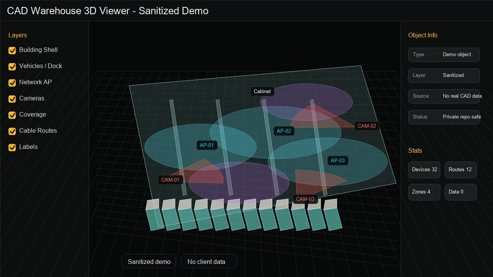

# CAD 强弱电 3D 读取器

通用开源 CAD 强弱电读取与 3D 预览工具。上传 DWG/DXF 后，按图层、块名、文字识别墙体、桥架、摄像头、AP、机柜、配电、照明等对象，并生成 Three.js 3D 场景。

本仓库服务的是**通用强弱电图纸**，不是只服务某一客户。弱电与强电走同一条读取链路。默认场地包是 `generic`。百世快运 `express`、供应链 `supply_chain` 是可选场地包，需要月台、车尾、炮楼等场地推断时再显式启用。



评测说明见 [`docs/generic-cad-eval.html`](docs/generic-cad-eval.html)（可用 `file://` 打开）。

---

## 最短上手流程

只依赖仓库内被跟踪的文件，不依赖任何被忽略的脚本、私有工具或客户图纸。
需要 **Python 3.10+**；DXF 流程**不需要** ODA，也不需要 Node.js。

### 1. 本机默认启动

macOS / Linux：

```bash
./start.sh                # 回环地址 + 自动挑端口（8000-8020）+ 自动打开浏览器
```

Windows（PowerShell）：

```powershell
.\start-project.ps1        # 或双击「启动项目.bat」
```

也可以不借助任何脚本，直接跑受管启动器（跨平台一致）：

```bash
python backend/server.py --port 8000 --no-open   # 首次先 pip install -r requirements.txt
```

`start.sh` 首次运行会自动创建 `.venv` 并安装 `requirements.txt`。脚本会打印实际访问地址
（默认 `http://127.0.0.1:<端口>/`）。健康检查：`GET /api/health`。

### 2. 用仓库内的合成样例跑通一遍

仓库自带一张合成图（无任何客户数据），可直接上传：

```
tests/fixtures/generic_electrical_min.dxf     # 5 个设备 + 2 条线路 + 1 个结构
```

也可以现场生成其它合成样例（单位、弧形/闭合、块变换、空图、未知块等）。
生成脚本**不会**改写仓库内被跟踪的夹具，默认写到临时目录并打印路径：

```bash
# 重新生成与仓库夹具等价的一张图（写到临时目录）
python -m tests.eval.make_generic_fixture
# 写到指定路径
python -m tests.eval.make_generic_fixture ./sample.dxf

# 生成其它类型的样例（bulge=弧形+闭合 / unit_scale_line=单位 / block_transform=块变换 …）
python -c "import sys; sys.path.insert(0,'.'); from pathlib import Path; from tests.synthetic import BUILDERS, build_named, write_dxf; \
print(', '.join(sorted(BUILDERS))); write_dxf(Path('sample-bulge.dxf'), build_named('bulge'))"
```

可用生成器：`basic`、`bulge`、`empty`、`unit_scale_line`、`block_transform`、
`duplicate_legend`、`unknown_block`、`unsupported_entity`、`role_block`、`role_block_unrotated`、`nested_role_block`。

### 3. 解析并查看结果

1. 页面左上「上传 DWG/DXF」→ 选 `tests/fixtures/generic_electrical_min.dxf`。
2. 解析默认走 `generic` profile（不启用任何客户场地推断）。
3. 右侧图层面板可开关图层；「视角控制」可切换透视 / 俯视 / 重置视角。
4. 「实时日志」会显示读取实体数、单位解析结果、识别到的设备/线路/结构数量。

### 4. 导出

- **项目导出（JSON）**：`GET /api/projects/{id}/export`，用于二次处理或核对。
- **静态导出（HTML）**：页面「文件 / 分享 ▾ → 导出静态 HTML」，生成自包含离线页。
- **分享链接**：同一菜单里的「复制分享链接」（需要认证时使用作用域分享令牌，见下文）。

### 5. 可选的局域网认证与受控分享

```bash
./start.sh --lan              # 自动生成访问令牌并打印带 token 的地址
```

局域网模式下未认证的访问者读不到任何项目与导出文件；把带令牌的地址发给可信同事即可。
分享单个导出页时使用「复制分享链接」，它签发的令牌**只对那一个导出页有效**、可过期、可撤销，
且**不含**主访问令牌。

### 6. 停止服务

```bash
./stop.sh                     # macOS / Linux
```

```powershell
.\stop-project.ps1            # Windows
```

### 7. 常见错误与恢复

| 现象 | 原因与处理 |
|---|---|
| 页面一直停在「需要访问令牌」 | 服务启用了访问控制。粘贴启动日志里打印的令牌；忘掉令牌可重启服务重新生成，或查 `CAD_ACCESS_TOKEN`。 |
| 登录后立刻又被要求登录 | 浏览器禁用 Cookie 时无法维持会话；改用「在 URL 带令牌」的方式（`http://127.0.0.1:<端口>/?token=<令牌>`）。 |
| 输入框提示「访问令牌不正确」 | 令牌抄错或服务已重启换了令牌；从启动日志重新复制。 |
| 上传 DWG 报 503 | 本机没有 ODA File Converter（仅影响 DWG）。**改传 DXF 即可**，或安装 ODA 后重启。 |
| 解析报错并提示「DXF 解析失败」 | 文件不是合法 DXF/DWG，或版本过新；用 `ezdxf` 支持的版本另存后再试。 |
| 页面提示单位待确认 | 图纸未声明单位（`$INSUNITS=0`）或单位码未知；解析时显式选择单位（见「单位与几何」）。 |
| 端口一直显示被占用 | 脚本会自动跳到 8000-8020 内的空闲端口；也可 `./start.sh --port 8123` 指定。 |
| 停止脚本说没找到实例 | 服务可能没在跑；确认 `.cad-runtime/server.json`（或 Windows 的 `.cad-server.json`）是否存在。 |
| 「导出静态 HTML」按钮不可用 | 该能力不可用时会返回 503 并说明原因；`GET /api/health` 的 `capabilities` 会列出具体原因。 |

---

### 关于 DWG 与 DXF（能力边界，务必分清）

| | DXF | DWG |
|---|---|---|
| 是否需要额外工具 | 否，`ezdxf` 直接读 | **需要 ODA File Converter**（免费但需自行安装） |
| 干净检出可用性 | ✅ 可用 | ⚠️ 取决于本机是否安装 ODA |
| 未安装时上传表现 | 正常 | 返回 **503**，提示「DXF 不受影响，可直接上传 DXF」 |

本仓库**不附带** ODA，也不会代为安装。`GET /api/health` 的 `oda_available` 与
`capabilities.dwg_convert` 会如实报告本机状态；未安装时请不要把 DWG 能力描述为已支持。

### 局域网访问速查

```bash
./start.sh --lan                                  # macOS / Linux：自动生成令牌
.\start-project.ps1 -Lan                          # Windows：同上
CAD_ACCESS_TOKEN=<令牌> python backend/server.py --host 0.0.0.0   # 手动指定
```

未设置令牌时绑定非回环地址会被**拒绝启动**（不会以无鉴权状态暴露到局域网）。
局域网模式下未认证的访问者读不到任何项目与导出文件；完整规则见下文「访问模型与安全边界」。

---

## 能力矩阵（干净 checkout 实测）

`GET /api/health` 返回 `capabilities`，前端据此隐藏/禁用不可用入口——不会出现「按钮在、点下去必然失败」的情况。

| 能力 | 干净检出 | 依赖 | 不可用时的表现 |
|---|---|---|---|
| `dxf_parse` DXF 解析 | ✅ 可用 | `ezdxf` | 返回 503 并说明缺少依赖 |
| `dwg_convert` DWG → DXF | ⚠️ 取决于本机 | ODA File Converter | 上传 DWG 返回 503，并明确提示「DXF 不受影响，可直接上传 DXF」 |
| `static_export` 静态导出 | ✅ 可用（仓库内置导出器） | 无额外依赖 | 返回 503 + 原因 |
| `share_link` 分享链接 | ✅ 可用 | 同静态导出 | 返回 503 + 原因 |
| `visual_audit` 视觉审计截图 | ✅ 可用 | `matplotlib` | 返回 503 + 原因 |
| `replay` 逐图层复原编排 | ❌ 默认不可用 | 内部 `orchestrator/` + Playwright | 全部端点返回 503，`/api/replay/status` 也报告 `available: false` |

**`replay` 说明：** 逐图层复原校验依赖内部编排器 `orchestrator/`，该目录**不在公开仓库内**（被 `.gitignore` 排除）。本地若部署了该模块，可用 `CAD_ENABLE_REPLAY=1` 打开，或用 `CAD_REPLAY_RUNNER=<模块名>` 指向自定义 runner。

**DXF 不需要 ODA。** ODA File Converter 只用于 DWG → DXF 转换；缺失它不影响 DXF 图纸的全部功能。

---

## 访问模型与安全边界

本工具定位是**本机单用户工具**，不是公网服务。

### 默认（回环 + 未配置令牌）

零摩擦：本机打开页面即可上传、解析、摆放、导出，无需登录。

### 启用访问令牌后（`CAD_ACCESS_TOKEN`，或局域网模式 `--lan`）

**默认拒绝 + 显式白名单**。这时未经认证的访问者**不能枚举、读取或导出任何项目与图纸内容**：

| 访问面 | 未认证时的行为 |
|---|---|
| `/api/**`（项目列表、项目详情、语义数据、导出、模型覆盖、项目包、站点配置、模型目录、单位、replay 状态与日志…） | **401**，且响应体不含项目 ID/名称/图纸数据 |
| `/exports/**`（静态导出 HTML 及其关联文件） | **401**，`GET` 与 `HEAD` 都不放行 |
| `/ws/logs`（实时日志 WebSocket） | 握手被拒绝（close 1008） |
| `/api/health` | 200，但只返回 `ok` / `auth_required` / 各能力是否可用；**不回显本机路径与 ODA 路径** |
| `/api/auth/session`、`/api/auth/login`、`/api/auth/logout` | 匿名可用（这是登录入口本身） |
| `/`、`index.html`、`*.js`、`*.css`、`/vendor/**`、`/share-config.js` | 匿名可用（否则连登录界面都加载不出来；这些文件来自公开仓库，不含项目内容） |

**Host / Origin / CORS 只防跨源滥用，不是身份认证。** 不带 `Origin` 的脚本客户端（curl / 脚本）
同样必须携带令牌，否则 401。

### 浏览器登录体验

1. 未认证打开页面会显示**登录界面**，粘贴访问令牌即可。
2. 登录成功后服务端设置一个 **HttpOnly 会话 cookie**（`cad_session`），此后 API 调用、
   WebSocket 与**直接点开 `/exports/` 下的导出文件**都能通过校验——`<a href>` 无法附带自定义请求头，
   会话 cookie 是唯一可行方式。
3. 令牌只保存在本机浏览器（`localStorage` + HttpOnly cookie），**不写入日志、不写入导出内容、不出现在分享链接里**。
4. 令牌错误或会话过期时，界面会明确提示「访问令牌不正确」并停留在登录界面，重新输入即可恢复。
5. 认证模式下顶栏有「退出登录」入口，会清除会话 cookie 与本机保存的令牌。

启动脚本带令牌打开浏览器时使用 `http://127.0.0.1:<端口>/?token=<令牌>`；前端会立刻把 URL 里的
令牌清掉（`history.replaceState`），避免留在浏览器历史里。

### 分享链接

**分享默认需要认证。** 同时提供了一种**作用域分享令牌**，让未认证的人也能看某一个导出页：

- 由 `POST /api/projects/{id}/share-link` 生成（会**写文件**，因此是 POST，不是可被预取的 GET）。
  `GET` 形式保留兼容，但只返回"需要认证"的链接，**不签发**分享令牌。
- 分享令牌与主访问令牌**完全独立**：由随机数生成，无法从主令牌推导，也**不能**用于任何 `/api/*`。
- **作用域限定到那一个导出文件**：访问其他项目、其他导出文件或任何 API 都是 401。
- **可过期、可撤销**：默认有效期 `CAD_SHARE_TTL_HOURS`（24 小时）；
  `GET /api/projects/{id}/share-tokens` 列出（**不回显令牌本身**），
  `DELETE /api/projects/{id}/share-tokens` 撤销该项目的全部分享令牌。
- 分享链接形如 `http://<host>/exports/static-pages/<项目>/<文件>.html?share=<分享令牌>`；
  **链接中不含主访问令牌**。把链接转发出去等于把该导出页的查看权交给对方，直到过期或被撤销。
- 签发失败时会如实返回 `share_error`，并退回"需要认证"的链接，**不会**给出无保护的链接。

### 其它边界

- **默认只监听 `127.0.0.1`。** 绑定非回环地址必须显式开启局域网模式 **且** 设置访问令牌，否则拒绝启动。
- **同源校验。** 浏览器请求的 `Origin`/`Referer` 必须与请求 `Host` 一致，或落在显式配置的开发来源里（`CAD_DEV_ORIGINS`，默认含 Vite 的 5173/5174）。跨源读写一律 403。
- **Host 校验。** 非回环、非显式配置的 `Host` 直接 403，防 DNS rebinding。
- **客户端只提交 ID，不提交路径。** 图纸/项目的文件路径一律由服务端解析，并校验落在允许根目录内；绝对路径、`..`、符号链接越界、跨平台路径（`C:\`、UNC）全部拒绝。同一策略覆盖读取、保存、导出、归档、恢复、打开文件与项目包导入。
- **导出内容不泄露本机路径。** 项目导出、静态导出页都不会包含 `save_dir`、`semantic_path` 等本机绝对路径。
- **上传边界。** 默认上限 512 MB（`CAD_MAX_UPLOAD_MB`），流式写入超限即中止并清理临时目录；解析并发上限 `CAD_PARSE_CONCURRENCY`（默认 CPU 核数的一半）。

在受管目录之外保存的历史项目需要显式授权：设置 `CAD_ALLOWED_PROJECT_ROOTS`（路径分隔符分隔）。未授权时这些项目只读可解析，不会写回本机其它目录。

### 相关环境变量

| 变量 | 默认 | 说明 |
|---|---|---|
| `CAD_HOST` | `127.0.0.1` | 绑定地址 |
| `CAD_PORT` | 自动挑 8000-8020 | 监听端口 |
| `CAD_LAN_MODE` | 关 | 设为真值即绑定 `0.0.0.0`（需令牌） |
| `CAD_ACCESS_TOKEN` | 空 | 访问令牌 |
| `CAD_DEV_ORIGINS` | Vite 5173/5174 | 允许的额外浏览器来源，逗号分隔 |
| `CAD_ALLOWED_HOSTS` | 空 | 允许的额外 `Host` 头 |
| `CAD_MAX_UPLOAD_MB` | `512` | 上传大小上限 |
| `CAD_PARSE_CONCURRENCY` | CPU/2 | 同时进行的解析数 |
| `CAD_ALLOWED_PROJECT_ROOTS` | 空 | 显式登记的受信项目根目录 |
| `CAD_RUNTIME_ROOT` | `backend/` | 运行期数据根（项目/上传/日志） |
| `CAD_ENABLE_REPLAY` | 自动探测 | 强制开启/关闭 replay |
| `CAD_SHARE_TTL_HOURS` | `24` | 分享令牌有效期（小时） |
| `CAD_SHARE_TOKENS_PATH` | 运行期目录下 `share/share-tokens.json` | 分享令牌存储位置 |

---

## 单位与几何

- 内部坐标统一为**毫米**。`$INSUNITS` 完整映射（`1 in = 25.4 mm`、`2 ft = 304.8 mm`、`4 mm`、`5 cm`、`6 m`、`21 US survey ft` 等）。**10 英尺 = 3048 毫米**。
- **无单位（`$INSUNITS=0`）与未知单位码不会被静默当作毫米**：解析结果带 `unit_unspecified` 与 `unit_warning`，可用 `GET /api/units` 列出可选项，并在解析请求里用 `unit` / `unit_scale_to_mm` 显式指定。
- **多段线 bulge**（凸度）被完整支持：长度包含真实弧长，闭合多段线计入闭合边；`geometry.segments` 给出逐段的直线/圆弧描述（圆心、半径、起止角、弧长），`geometry.curve_points` 提供按弦高误差（默认 5 mm）离散后的折线，供渲染画弧而不是画弦。
- **ARC 弧长**按 DXF 语义计算（逆时针 `start → end`，`(end-start) mod 360`），270° 的弧不会被当成 90°。
- **块引用变换**（旋转、镜像/负缩放、非均匀缩放、嵌套）按实体 OCS 正确展开；镜像块曾丢失插入点平移，现已修复并加回归测试。
- 每个实体保留 `source_entity_id`（DXF handle），预览坐标可回溯原始实体。

### 识别结果的来源与可追溯性

每条结果区分**来源**并保留追溯键，便于人工复核：

| 来源 | 标识 | 含义 |
|---|---|---|
| 原始 CAD 实体 | `source_entity_id`（DXF handle）、`entity_type`、`layer` | 直接来自图纸，可定位回原图 |
| 规则推断 | `rule_id` / `active_rule_sets`、`route_source`、`attributes.source_kind` | 由 `mapping.yaml` / profile 规则匹配得出 |
| 人工摆放 | `attributes.source_kind = "placement_studio"`，存于独立 `model-overrides` | 与规则推断分离，重新解析不会覆盖 |

识别结果中带 `confidence` 与 `review_needed`，质量报告（`quality`）会给出待复核项与图层审计，
供人工判断而不是直接把推断当成事实。

### 已知限制（不要按「通用识别已完成」理解）

- **规则是关键词 + 图层/块名匹配**，不是几何理解，也不会用 LLM 补全缺失建筑。
  命名规范差异大的图纸识别率会明显下降；`unknown` 计数与质量报告里的待复核项即反映这一点。
- **块嵌套超过一层时不会展开虚拟几何**（实测记录，见 `tests/test_dxf_blocks.py`）：
  外层块命中角色、内层再引用图形时，`cad_virtual_shapes` 为空。
- 只有命中 CAD 角色关键词的块（如摄像头 / AP / 半球 / 鱼眼 / 枪机，以及车位兜底）才会生成
  虚拟几何；其他块只保留插入点与块名。
- **DIMENSION 的渲染文本与块内标注**、MINSERT、XCLIP 未测试。
- **UCS/倾斜 extrusion** 只做了平面长度补偿，缺少合成夹具覆盖。
- DWG 转换的正确性取决于本机 ODA；**DWG → DXF 链路本身未经本项目测试**（未附带 ODA）。
- 没有公开的大图纸性能基准，因此**不承诺**解析耗时、内存或首屏时间。

---

## 数据存储与并发

- `backend/storage.py` 只负责**服务端管理的路径**：项目 ID、图纸 ID 先校验再拼路径。
- 所有 JSON 写入是**原子写**（同目录临时文件 + `fsync` + `os.replace`）；写中断不会破坏旧文件。
- read-modify-write 全过程持有文件锁（进程内可重入锁 + POSIX `flock`），并发上传/保存不丢更新。
- 项目与人工摆放（overrides）都带 **revision**；旧版本保存返回 **409 冲突**，不会覆盖别人的新修改。
- JSON 损坏**不再静默当空数据**：原文件被隔离为 `*.corrupt-<时间戳>` 并返回明确错误，可从隔离副本恢复。
- **人工摆放与规则推断分开存储**：人工校正写在 `model-overrides/model-overrides.json`，重新解析只新增图纸记录，不会清空人工结果。

---

## 默认 profile

| Profile | 作用 |
|---|---|
| `generic` | **默认**。只按图层 / 块 / 文字读墙、桥架、摄像头、AP、机柜、配电、照明；不启用月台、车尾、炮楼推断。 |
| `express` | 可选快运场地包。月台、车尾摄像头、射灯、鱼眼 / 半球等。 |
| `supply_chain` | 可选仓储供应链场地包。货架 / 工位 / 分拣 / DWS 按场地规则渐进启用。 |

解析请求携带 `site_profiles`。不传或只传 `generic` 时走通用读取；**场地专用推断不会被隐式启用**。

```json
{ "file_id": "<upload_id>", "site_profiles": ["generic"] }
```

可用 `GET /api/site-profiles` 查看登记列表。

## 使用流程

1. 启动后打开本地页面。
2. 上传 DWG 或 DXF（DXF 无需 ODA）。
3. 解析默认走 `generic`。需要场地推断时再显式启用 `express` / `supply_chain`。
4. 后端用 ezdxf 读实体（DWG 先经 ODA 转 DXF），规则引擎生成语义结果。
5. 前端 Three.js 生成 3D。用图层开关、视角和对象信息面板查看。
6. 需要人工摆放时，在「摆放试验场」项目里摆放/移动/撤销并保存；保存的是独立 overrides
   （`model-overrides/model-overrides.json`），与规则推断结果分离，重新解析不会清空。
7. 保存带 revision：两个页面同时编辑时，旧版本保存会得到 **409 冲突**而不是覆盖对方修改。

---

## 测试与评测

安装测试依赖（与运行依赖分开）：

```bash
pip install -r requirements-dev.txt      # 需要 httpx（TestClient）与 pytest
python -m pytest tests/ -q
```

公开合成夹具严格评估：

```bash
python -m tests.eval.runner --fixtures-only --strict
```

`--strict` 会把 desired / geometry 缺口也视为失败（退出码 2）。公开夹具矩阵覆盖：基本强弱电、空图、英尺/米/毫米、无单位、弧形与闭合多段线、块变换（旋转/镜像/非均匀缩放/嵌套）、重复图例、未知块、畸形输入与不支持的实体类型。夹具全部由 `tests/synthetic.py` 现场生成到临时目录，**运行测试不会修改被跟踪的夹具文件**。

测试依赖说明：HTTP 层测试需要 `httpx`（Starlette `TestClient` 的依赖）。它已在 `requirements-dev.txt` 中显式固定；缺少时测试会明确报错，而不是静默跳过——不会去改动全局环境。

私有历史回归：

```bash
python tests/regression_counts.py     # 需要本机已有解析结果
```

**CI：** `.github/workflows/tests.yml` 在 Python 3.10 与 3.12 上跑 `pytest tests/` 与 `runner --fixtures-only --strict`，不需要 ODA、不需要客户数据。

---

## 隐私与发布边界

以下内容**永不入库**：

- 客户 `*.dwg` / `*.dxf`（公开合成夹具 `tests/fixtures/**/*.dxf` 由代码生成，不含客户数据）
- `semantic.json` 与解析结果
- 客户项目目录（`backend/projects/`、`backend/uploads/`、`projects/` 等）
- 日志、备份、评测导出、本机运行状态（`.cad-runtime/`）

`.gitignore` 按目录屏蔽客户资料与内部工具（`orchestrator/`、`tools/`、多数 `docs/`）。**不会**为了提交而整体放开这些屏蔽。

已检查范围：当前全部被跟踪文件、本分支完整差异、以及仓库可获取的全部提交历史，均使用本地命令完成，
未将仓库或任何图纸上传第三方扫描服务。检查**不能保证**不存在未被模式识别的敏感内容；
历史提交中曾出现的内部局域网地址已从当前文件移除，但**历史记录仍未清除**（清除需改写历史，
属维护者决策，详见 [`RELEASE_READINESS.md`](RELEASE_READINESS.md)）。

`SPEC.md` 与 `AGENTS.md` 是早期设计文档，其中的 Vue/Pinia 方案**仅作历史参考**：当前实现是原生 JS + Three.js，没有构建步骤；后续不会据此迁移前端。

### 许可证

**本仓库当前没有 `LICENSE` 文件，也没有声明整体许可证。** 在维护者明确决定之前：

- 默认版权状态为「保留所有权利」。公开可见 ≠ 已授权他人使用、修改或再分发。
- 这是**维护者决策项**，不是技术缺口：需要所有者选定许可证（例如 MIT / Apache-2.0 / 其他），
  并确认可以对仓库内全部内容授权。
- 由 agent 代选的许可证不具有授权效力，因此本项目不会代为添加 `LICENSE`。
- **决策材料**：内容来源分类（项目自有 / 第三方 / 来源待确认）、许可证方案对比、
  公开范围与历史遗留问题的选项，以及各项对「合并」与「正式开源发布」的阻塞关系，
  已整理在 [`RELEASE_READINESS.md`](RELEASE_READINESS.md)。

随仓库分发的第三方内容：

| 内容 | 许可 | 说明 |
|---|---|---|
| `frontend/vendor/three/` | MIT（Three.js） | 原样保留，未修改 |
| `docs/assets/demo-sanitized.png` | 项目自有（脱敏演示图） | 不含客户信息 |

客户图纸、客户规则与内部工具**不属于**可授权范围，也不会加入本仓库。

---

## 项目状态与公开路线图

### 已完成并验证

| 能力 | 验证方式 |
|---|---|
| DXF 原生解析与强弱电识别（**不需要 ODA**） | `pytest tests/` 311 项通过；`tests/eval` 10 个公开合成用例 `--strict` 零缺口 |
| 单位换算（含英尺；无单位不误判）、bulge 弧长、闭合边、ARC 弧角语义 | `tests/test_dxf_units.py`、`tests/test_dxf_geometry.py` |
| 块变换（旋转 / 镜像 / 非均匀缩放 / 嵌套） | `tests/test_dxf_blocks.py` |
| 存储可靠性（原子写、并发不丢、revision 冲突 409、损坏隔离） | `tests/test_path_policy_and_storage.py` |
| 访问边界（默认拒绝、导出文件保护、作用域分享令牌、撤销与过期） | `tests/test_auth_enforcement.py`、`tests/test_share_auth.py` |
| 浏览器可用性（登录、读项目、导出、分享、撤销） | Chrome 实测：认证流程 17/17、本机默认模式 29/29 |
| 本机与局域网启动/停止、状态清理 | 干净检出上手流程 36/36 |

### 尚未验证（不要视为已支持）

- **Windows**：`start-project.ps1` / `stop-project.ps1` 已在 macOS 上完成逻辑调整，但**没有 Windows 环境做真实验证**。
- **HTTPS**：会话 cookie 的 `secure` 标志按请求协议推断，未在真实 HTTPS 下验证。
- **多进程部署**：文件锁只在单进程内 + POSIX `flock` 层面有效。
- **DWG → DXF 转换链路**：代码路径存在，但本项目**从未测试过真实转换**；未安装 ODA 时上传返回 503。
- **私有客户历史回归**：没有可安全使用的私有数据集，因此不提供识别率或历史基准对比。
- **性能**：没有公开的大图纸基线，不承诺解析耗时、内存或首屏时间。

### 未来计划（按优先级）

| # | 任务 | 优先级 | 前置依赖 | 验收条件 |
|---|---|---|---|---|
| A1 | 合并后的首次使用验收：在**第二台干净机器**上按上面「最短上手流程」跑一遍，记录耗时与报错 | P1 | 无 | 结果与本地一致；差异给出原因 |
| A2 | 把上手链路纳入 CI：启动服务 → 上传合成样例 → 解析 → 导出 → 断言未认证 401 / 认证 200 | P1 | 需要 CI 友好的端口与超时策略 | CI 内可复现完整链路 |
| A3 | DWG 转换验证（**需要合法的 ODA 环境**） | P2 | 使用者自行安装 ODA；本项目不代装 | 有成功与失败两类记录；缺 ODA 时提示准确 |
| B1 | 扩展公开合成评估集：多图层同名设备、图例区混排、缺标注符号、大体量合成图 | P1 | 无 | 每个新用例先能失败再实现；`--strict` 零缺口 |
| B2 | 识别错误分类与质量报告细化（漏识别 / 误识别 / 低置信度 / 单位不确定 / 区域被忽略） | P2 | B1 | 报告能回答"哪些对象需要人工看" |
| B3 | 识别依据展示：在对象信息面板显示命中规则、来源实体类型/图层、置信度与待复核原因 | P1 | 无（只改前端展示，不动引擎） | 任选对象都能看到依据，缺失时明确显示"未知" |
| B4 | 人工修正回归：人工校正 → 重新解析 → 修正仍在 → 导出含修正 | P1 | 无 | 端到端用例覆盖该链路 |
| B5 | `rule_engine` 渐进拆分（先锁契约测试，再逐段提取单位/几何、分类、文本关联、去重、场地推断、质量报告） | P2 | B1 提供的回归网 | 每步提取前后公开夹具语义等价，调用签名与 schema 不变 |
| C1 | Windows 实测（启动 / 停止 / 认证登录 / 导出） | P1 | 需要 Windows 机器 | Windows 上完成「启动→上传→解析→导出」并记录 |
| C2 | 依赖维护：评估把仅内部能力需要的依赖（`playwright`、`matplotlib`）移出必需集 | P2 | 确认无外部使用者依赖当前清单 | 干净安装体积下降且不影响 DXF 全流程 |
| C3 | 大图性能基线：用**脚本生成的合成大图**记录实体量、解析耗时、峰值内存 | P2 | 需要合成大图生成脚本 | 形成可对比基线表；无数据前不承诺数值 |

### 明确不作为当前任务

以下是**范围选择**而非交付缺陷——本项目定位是**本机优先、可受控局域网使用**的工具，
不是公网多用户平台：账号体系与按用户审计、登录限速/防爆破、多进程横向扩展、
公网部署加固、BIM/IFC、LLM 自动补全缺失建筑、客户专属规则公开。
只有在确有对应需求时才单独立项。

### 维护者决策项

> 完整决策材料见 [`RELEASE_READINESS.md`](RELEASE_READINESS.md)（内容来源分类、许可证方案对比、
> 公开范围选项、历史遗留问题，以及各项对"合并"与"正式开源发布"的阻塞关系）。

1. **许可证**：仓库当前没有 `LICENSE`，默认「保留所有权利」。需要所有者选定许可证并确认可授权范围
   （客户图纸、私有规则、内部工具始终排除）。本仓库不代选、不代提交申请。
2. **可公开范围**：`docs/` 等目录是否长期不公开，`.gitignore` 是否调整。
3. **Windows 与 HTTPS 验证资源**：是否有环境做真实验证（对应 C1）。
4. **公网 / 多用户需求**：若无明确需求，对应能力不进入路线图。

## 依赖

**必需**（`requirements.txt`，Python 3.10+）：

| 包 | 用途 |
|---|---|
| `fastapi` / `uvicorn` / `python-multipart` / `websockets` | HTTP/WebSocket 服务与上传 |
| `ezdxf` | DXF 读取（**DXF 全流程的唯一 CAD 依赖**） |
| `PyYAML` | 识别规则与 profile 配置 |
| `aiofiles` | 上传流式写入 |
| `matplotlib` | 视觉审计截图（`visual_audit` 能力） |
| `playwright` | 仅内部 replay 编排器需要；公开分发不含 `orchestrator/`，因此该能力默认不可用 |

**可选（不由本仓库附带，需自行安装）**：

- **ODA File Converter**：仅用于 **DWG → DXF**。缺失时 DWG 上传返回 503，**DXF 不受影响**。
  可用 `GET /api/health` 的 `oda_available` / `capabilities.dwg_convert` 查看本机状态。
- **Node.js**：仅在使用 `./start.sh --vite` 的开发预览时需要；默认页面由 FastAPI 直接提供，**不需要 Node**。

**测试**（`requirements-dev.txt`）：`pytest` 与 `httpx`（Starlette `TestClient` 需要 httpx）。
缺少 httpx 时 HTTP 层测试会明确报错，而不是静默跳过；不会去改动全局环境。

```bash
pip install -r requirements-dev.txt    # 运行 + 测试依赖
```

离线安装可先 `pip download -r requirements.txt -d wheelhouse`，再把 `wheelhouse/` 一并拷走。
